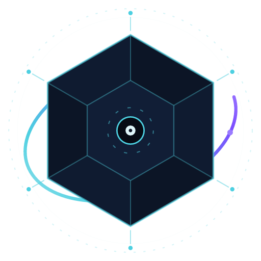

# Synapse — AI 原生操作系统

<p align="center">
  
  <br>
  <b>SYNAPSE &nbsp;AI-OS</b>
  <br>
  <sub>AI 原生操作系统 · 让 Agent 成为一等公民</sub>
</p>

<p align="center">
  <a href="LICENSE"></a>
</p>

> 一个从零自研的 x86_64 微内核，目标是让 **AI Agent 成为一等公民**：
> 内核态只保留调度 / 内存 / IPC / 能力（Capability）原语，所有 AI 业务
> （外交工具、Agent 运行时、记忆系统）全部运行在用户态，受 Capability
> 权限模型与审计事件流约束。
>
> **当前状态**：✅ Phase 0~3 已完成（裸机点亮 → 内存 / 中断 / 异常框架 → TSC 时钟校准 →
> kthread 多任务 / switch_to / 抢占调度 / Mutex / FR8 核算 / FR10 冻结与频率围栏），
> 真机 QEMU smoke 全部通过。下一步：Phase 4 用户态与 IPC。
>
> **任务看板**：[`task.json`](task.json)（唯一事实来源） · **开发规则**：[`docs/design/rule.md`](docs/design/rule.md) · **设计文档索引**：[`docs/README.md`](docs/README.md)

---

## 1. 为什么做这个项目

现有 OS 把 AI Agent 当普通进程对待：权限粗粒度（文件系统 / 网络全有或全无）、
行为不可审计、资源不可核算。Synapse 的回答是：

- **Capability 安全模型** — Agent 的每项权限（对象访问、IPC、设备）都是可委托、
  可撤销、可审计的能力对象，支持 L1~L5 分级授权与高风险操作人工确认通道。
- **微内核 + 用户态外交工具** — 网络出口收敛到唯一持有网卡能力的外交工具进程，
  架构性保证"唯一网络出口"不变量；内核仅提供 IPC 与中断路由。
- **AI 原生原语** — 资源核算（FR8）、进程冻结 / 频率计数（FR10）、
  append-only 审计事件流（FR9）从内核层直接支撑 Agent 监督树与行为围栏。

设计取舍详见 [ADR 00：从零自研 vs 二次开发](docs/design/00-adr-from-scratch.md)
与 [需求目标.md](需求目标.md)（FR/NFR + 六阶段路线图）。

## 2. 架构总览

```text
┌─────────────────────────────────────────────────────────┐
│  用户态（规划中，Phase 4+）                               │
│  Agent 运行时 · 外交工具(smoltcp/virtio-net) · 记忆系统    │
├──────────────── syscall (18 个, ABI 见设计文档 02) ────────┤
│  内核态                                                  │
│  cap/   Capability 表 · 对象表 · 委托/撤销级联             │
│  ipc/   Endpoint(同步) · Notification(异步) · 单拷贝路径    │
│  proc/  进程表 · Agent 注册表 · spawn/exit/reap            │
│  sched/ TCB 状态机 · runqueue · sleep 队列 · FR8 核算 · FR10 频率计数│
│  kernel/ 引导链 · 页帧/堆 · GDT/TSS/IDT · PIC/PIT · TSC · kthread/switch_to/抢占调度 · paging/AS/VMA│
│  hal/   硬件抽象 Trait (Mmu/Interrupt/Timer/Serial)        │
│  audit/ 审计事件流（骨架）                                 │
└─────────────────────────────────────────────────────────┘
```

`cap/`、`ipc/`、`proc/`、`sched/` 为零依赖纯逻辑 crate（`#![deny(unsafe_code)]`），
宿主端 188 个单元测试全绿；内核集成层用 IRQ-safe SpinLock 包装后已在
QEMU 真机跑通端到端 smoke（spawn → 委托 → 撤销 → IPC → exit → reap）。

## 3. 进度（详细状态见 [task.json](task.json)）

| Phase | 内容 | 状态 |
| --- | --- | --- |
| P0 | 环境与基线（nightly-2026-09-23 锁定 + QEMU + 工具链验证） | ✅ 完成 |
| P1 | 裸机点亮与工程基建（三级 boot 链 · UART · log/panic 回溯 · CI · 测试框架） | ✅ 完成 (11/11) |
| P2 | 内存 / 中断 / 异常（E820 · 页帧分配器 · 内核堆 · GDT/TSS/IST · IDT · PIC/PIT · TSC 校准） | ✅ 完成 (7/7) |
| P3 | 多任务与调度（sched/ 纯逻辑 crate · switch_to 汇编 · 抢占模型 · Mutex · FR8/FR10 原语） | ✅ 完成 (8/8)：T1 sched crate ✅ · T2 FR8 核算 ✅ · T3 FR10 频率计数 ✅ · T4 kthread 基建 ✅ 真机 28/28 · T5 switch_to 汇编 ✅ 真机双线程往返 9/9 · T6 抢占模型接线 ✅ 真机 3-worker 交错 9/9（时间片抢占 + yield/sleep/exit/reap） · T7 Mutex 睡眠锁 ✅ 真机 2-worker 互斥 9/9（M_ITERS=2000 加压） · T8 集成收尾 ✅ 真机 23/23（FR8 TSC 记账守恒 + 页账本零泄漏 · FR10 进程冻结/频率围栏 · 阻塞点 IRQ 窗口竞态根因修复） |
| P4 | 用户态与 IPC（用户地址空间 · syscall · ELF 加载 · init 进程） | 🔄 进行中 (7/14)：已分解 14 任务（T1 target+ELF → T12 PCID+收尾 · T13 cap syscall 接线+安全回归 · T14 NFR2 基准+idle 根治，T13/T14 自 s6 分支缺口审查并入）· T1 ✅ 用户态 target json + 基址 1GB 链接脚本 + 第一个静态 ELF · T2 ✅ 内核 4KB 页表 + AddressSpace（CR3 切换/用户页读写/#PF 期望故障恢复，真机 15/15）· T3 ✅ VMA 表 + 按需分页缺页路径（synapse-vma 纯逻辑 crate 20/20 宿主测 + 内核 handle_user_fault 接 idt#PF 真机 14/14：VMA 注册/需求映射/权限违例 kill/未注册 kill/NULL guard/FR8 归零；顺带强化 #PF trampoline 保存 caller-saved GPR 让 faulting 指令正确重执）· T4 ✅ Ring3 切换 smoke（GDT ring-3 描述符启用 + TSS.RSP0 16KB 内核栈 + MSR STAR/LSTAR/FMASK/IA32_KERNEL_GS_BASE 配置 + syscall 入口汇编 swapgs→切内核栈→push GPR→dispatch→sysret + iretq 首次进入用户态 + CPL=3 往返；真机 exit 363：用户态 _start 跑起 → syscall abi_query 往返 → 用户态写共享页 → syscall process_exit → 内核 iretq 回 continuation → ABI 值回读校验 → FR8 归零；顺带修 PML4[0] 缺 U/S 位致 user walk 在 PML4 级被拒 + syscall frame push 顺序错位导致 dispatch 误读 user_RSP 为 num）· T5 ✅ 静态 ELF 加载器 + initramfs（synapse-elf 纯逻辑 crate：ELF64 ET_EXEC 完整校验 20 错误变体 + cpio newc 解析器，宿主 18/18；构建管线 xtask cpio 写器 → build_disk.py 把 initramfs 追加在 kernel.bin 后由 stage2 连续加载、0x20100 写 {base,size} 引导记录；内核 initrd.rs + page_frame 出账保留 + elfload.rs 装入用户 AS（逐页 alloc/清零/拷贝/映射 W^X + 用户栈 entry RSP=TOP-8）→ iretq 进 hello e_entry；真机 exit 363：hello ring-3 跑 abi_query 往返 → process_exit → continuation 断言计数=2 + CR3 还原 + 逐页 unmap/free + FR8 回基线；顺带修 T4 遗留两 bug：process_exit iretq 路径缺平衡 swapgs 致再进用户态首次 syscall #DF + sysretq 前未还原 user RSP 致真实 ELF pop 即 #PF）· T6 ✅ syscall 分发 + 基础调用（abi crate：Doc 02 §4.3 错误码 10 常量 + Timespec + clock_id + prot/flags 位（与 vma RegionFlags 低位对齐零转换）+ ABI_MINOR 1→2，宿主 16/16；内核 dispatch 重写：synapse_abi::decode 严格解码接入，未知号/窄参数越界 → IllegalSyscall 杀进程（ring3 stub #999 真机验证 count==1），外壳统一 frame.num 写回（修旧路径负错误码不写回 → 用户态读旧号的潜伏 bug）；gettime 接 clock.rs TSC 单调钟（WALL 延后 -10，user_mem_ok 前置逐页校验）；umem.rs mmap eager 映射（bump 0x4100_0000/显式 hint + prot/flags/len 全错误路径 -2/-3/-5/-7/-10）+ munmap 精确匹配 ACTIVE；yield/exit 接 sched；hello 重写为 6-syscall 全序列真机测试程序（成功路径 + 每条错误路径负码断言 + mmap 写读回环 + 单调钟两次不减）；真机 exit 363：elf-smoke PASS umem stats mmap 4ok/11err + munmap 4ok/5err + FR8 回基线；前置 merge s6@b5b2e8d 引入 P3-T8 竞态修复解除 mutex smoke 阻塞，P3-T8 marker i/j 撞 P4-T4 → 迁 s/t）（独立 worktree d:/ai-os-p4，分支 claude/p4-userspace）· T7 🔄 IPC 内核接线 Phase 1（kernel/src/ipc.rs ~1100 行：5 表 static + k_ipc_send/recv/reply/try_send + AUX sleepq + synapse_ipc Endpoint 状态机 + synapse_cap transfer_caps + walk_flags PA-to-PA 单拷贝；syscall dispatch 接 4 IPC 号 + ABI_MINOR 2→3 + 5 新错误码 -11..-15；真机 kthread_ipc_smoke marker u/v：A.send→B.recv→B.reply→A.recv + cap transfer + try_send Queued + 4 条错误路径全 PASS exit 363；hello 加 6 条 IPC 用例含 boot fence -4 围栏 + try_send 错误/Queued 路径；Phase 2 待 P4-T9 per-thread kstack 解除 boot fence 后启用真双向时序断言）· T8 ✅ Notification signal/wait syscall（kernel/src/ipc.rs 加 `kthread_notif_smoke` marker w/x：单 cap table 92 + alloc notification + mint SEND|RECV cap → signal(0xA5)→wait(0xA5)==Some(0xA5)→re-read 空；signal(0xFF)→wait(0x0F)==Some(0x0F) 部分清 + wait(0xF0)==Some(0xF0) 清残留；mask=0 恒返 Some(0)；signal(bits=0) no-op；PASS exit 363；synapse_ipc::Notification 补 `clear_matched` 位图 AND NOT + 返清前掩码给 kstate::k_notify_wait 读清语义；kstate::k_notify_signal/wait + syscall.rs sys_notify_signal/wait + resolve_notification helper（SEND/RECV 权校验 + ObjKind::Notification 类型检查 + E_INVALID_CAP/E_PERMISSION/E_OBJECT_RETIRED 错误码映射）；spawn.rs 给子进程铸 child_no_obj + child_no_cap slot 2 与 init bootstrap no_cap 槽号对齐、复用空表 + hello §8 硬编码 no_cap=2 不撞；user/hello §8：signal(0xA5)→wait(0xA5)=0xA5、re-read=0、多源 signal(0xFF)→wait(0x0F)=0x0F、mask=0→0、signal bits=0 no-op、cptr=0 → -1、非 Notification kind（ep_cap）→ -1；真机 exit 363，11 smoke 套件全绿含 [notif-smoke] obj_idx=6 cap=1 PASS）· T9b ✅ spawn-smoke 真机验证（kernel/src/spawn.rs ~300 行：proc.spawn + k_create_cap_table + 装 hello ELF + KERNEL_FRAME 武装 + 切子进程 CR3/rsp0 + iretq 进 hello，子 process_exit → spawn_continuation 清理 AS/kstack/CapTable → exit 363；spawn-smoke PASS 真机 exit 363：child_pid=4 跑完 hello 7 节全路径 → `dispatch: num=21 process_exit(code=0)` → 内核接力清理 → 子走 kill 路径不再依赖、真正由自身 process_exit 收尾；期间暴露 3 集成 bug 全修：① 子进程 syscall 走 init 已 drop 的陈旧 AS — `current_as_ptr()` 仍指向 elf_continuation 释放掉的 init `as_user` → 子 hello §3 gettime 一碰 AS 即 E_INVALID_ADDR panic → abi_query/yield 不碰 AS 故前两条 syscall 正常（第 3 条 gettime 即 #GP）→ 加 `elfload::set_current_as_ptr`，spawn 切 AS 后立即更新；② 子 CapTable 是新建空表而 hello §6 硬编码 `ep_cap=1` — 不铸则 IpcRecv/try_send resolve 失败 → E_INVALID_CAP ≠ 期望 E_WOULD_BLOCK/-1 → panic → spawn_smoke 加 step 3b 全新 ep 铸造到子 slot 1（不能用 init 的 bootstrap ep：init §6.6 try_send 已留 queued 消息，子 §6.2 recv 会出队 Message 同样打破 -4 期望）；③ 帧预算爆 — debug profile 的 hello 2.8 MB initrd 预留 688 帧，page_frame 总量 294 − 256 heap = 仅 38 帧裸用，子 kstack+AS+Pcb 一加即帧出 → 末段 mmap 返 -3 E_NO_MEMORY → user/hello/Cargo.toml 加 `strip = "symbols"`，hello→90 KB / initrd→83 KB / initrd 预留从 688 降到 21，frame budget +667；另加 `kernel/src/proc_life` stub 模块让 T9c 已在 paging.rs 写好的 call sites 可编译（current_is_spawned_child MVP 恒 false 守住原 panic 语义，terminate_current unreachable-panic 兜底）。）· T9c ✅ 崩溃处理 + death notification（idt.rs `#GP ring3` 分支调 `terminate_current(FaultKind::SegFault, ..)`；syscall dispatch 中 `IllegalSyscall` / `ProcessExit` 异常路径同样归因；`proc_life::terminate_current` 投递 `DeathMsg{ fault=FAULT_*, exit_code, pid }` 到父 death_endpoint（`DEATH_LABEL=0xDEAD_0001`），spawn_continuation 收 `recv_death_msg()` 验证 fault=0；FaultKind 五态 SegFault/Panic/IllegalSyscall/IllegalInstruction/GeneralProtection → FAULT_* abi 常量入 `synapse_abi`，ABI_MINOR 3→4）· T9d ✅ process_reap syscall #22（`sys_reap(caller, target)` 两阶段：`release_resources()` 清 FR8 页账本 + CapTable 销毁 + endpoints/agent_id 注销 + 表项摘除；`ProcessReap` 分发 + `E_INVALID_CAP/E_NOT_FOUND/E_PERMISSION` 错误码统一映射；`proc_life::quota_denied_count/death_delivered_count` 计数器入 spawn_continuation 收尾断言）· T9e ✅ quota enforce（`kstate::k_quota_charge/release` 三路径插桩：`sys_mmap` 在 ACTIVE 注册后、eager_map 前 charge，失败回滚 ACTIVE + 返 -13；`sys_munmap` 释放；`cleanup_all` 整体归还；`INIT_QUOTA.max_pages=1<<20` 4GB 不触发，quota 拒绝由 crasher 子进程 `max_pages=16` 验证：mmap 64 页 → -13 + `quota_denied_count>=1`；`user/crasher` 全程 mmap/munmap → SegFault(0x5000_0000) → 父 death msg fault=1 FAULT_SEGFAULT → reap → FR8 回基线 256；crasher 通过 `xtask::user::USER_BINS` 串接进 cpio initramfs）· 真机回归修复（P4-T9 期间暴露 4 潜伏 bug，全 11 smoke 套件复绿 exit 363）：① #PF trampoline 借 callee-saved r12 传 resume RIP 却未保存/恢复 → 覆写调用者活跃变量（paging-smoke `unmap returns f1` 比对失败）→ push/pop r12 修复（真机 15/15）；② 修复①引入 rax clobber（`mov rax,r12` 覆写刚 pop 回的 rax）→ 需求分页重执 `mov rax,[rax]` 读到内核代码字节而非零页（vma-smoke 首页读非 0）→ 改 `xchg r12,[rsp+16]` 把 resume 直写 RIP 槽、不碰任何已恢复 GPR（真机 14/14）；③ **STAR_VALUE 常量字段错位** `0x0000_001B_0000_0008`（[63:48]=0 应为 0x1b、[47:32]=0x1b 应为 0x08、0x08 落保留位）→ sysretq 装载非法 CS=0x13/SS=0xb（kernel data/code 描述子 RPL3），64-bit 平坦模型下用户态带病运行，直到下次 ring3 中断把非法选择子压帧、handler iretq 查 GDT 才 #GP（error_code 0x20/0x13/0xb，elf-smoke/spawn 阻塞；ring3-smoke 因经手搓 iretq 帧不走 sysretq 而幸免）→ 归位 `0x001B_0008_0000_0000` + star_watchdog（rdmsr 校验 STAR[63:48]/LSTAR）作回归保险；④ **IPC recv boot-fence 状态泄漏** — k_ipc_recv 命中 `Waiting` 分支时 `ep.recv()` 已置 `receiver_waiting=true`，但 boot 围栏直接返回 E_WOULD_BLOCK 而不登记 recv_waiter/不清标记 → 后续 try_send 因残留标记误判 `Delivered` → 找不到 recv_waiter 返回 E_NOT_FOUND(-5)，hello §6.6 `assert r==0` 失败 panic → ring3 hlt #GP（此前被误当作 T9c kill 路径"通过"，实为测试完整性漏洞）→ 加 `Endpoint::cancel_recv` + `k_ep_cancel_recv`，围栏返回前回滚标记；修复后 hello 正常跑到 `process_exit(code=0)`、elf-smoke PASS（真机 exit 363，全套 smoke 复绿）；另修 startAIOS.ps1 判定读过期固定名 serial.log 的 bug（改为从 xtask stdout 解析本次 `serial-<ts>.log` 路径） |
| P4.5 | PCI 枚举与 IRQ 用户态化 + virtio 驱动实做 | 🔄 进行中 (1/5)：T1 ✅ PCI 子系统抽象（[kernel/src/pci.rs](kernel/src/pci.rs) 抽离 bootanim/block 私有拷贝，真机 exit=363 验证通过）· T2 IRQ_BIND cap + irq_bind/irq_forward syscall（[Doc 07 §1.1](docs/design/07-display-stack-and-spatial-shell.md) + [Doc 08 §1.1](docs/design/08-fs-ai-index.md) 一致契约）· T3 virtio-blk legacy MMIO 真实驱动（替换 block.rs stub，Doc 08 §3.1 P0 后端）· T4 virtio-net 用户态驱动预研 + diplomat 接入契约 · T5 P4.5 集成 smoke（exit=363 + 真机挂盘字节级回读） |
| P5 | 外交工具与 Agent 雏形 | 🔄 设计落地（9 任务 · 2026-09-27）：T1 diplomat 进程骨架（init spawn pid=2，持有 NIC Device + IRQ cap）· T2 Network + Channel cap 类型扩展（ABI_MINOR 4→5 + E_NETWORK_DENIED/-18 + E_CHANNEL_INVALID/-19）· T3 virtio-net 用户态实做 + smoltcp PHY 集成 · T4 API Channel 最小子集（HTTPS 出站 + 域名白名单 + JSON Schema + 超时 + 限流 + 审计）· T5 spawn 限制放开（持 PROCESS::SPAWN cap 即可）+ SupervisorTree 雏形 · T6 CryptoProvider trait + Ed25519 实现 + 审计 Signature 升级（[Doc 06 §13.2](docs/design/06-system-services-roadmap.md) 廉价埋点为 Phase 6 PQC 替换铺路）· T7 Agent 雏形（AgentBus pub/sub + Planner 远程 LLM + Executor 工具调用，端到端 "what time is it" demo）· T8 Security Gateway 最小子集（出站脱敏 SSN/email/IP + 入站 schema 校验 + 失败熔断）· T9 P5 集成 smoke + 闸门验收（[Doc 04 §3.2 E1/E2/E3](docs/design/04-diplomat-channel-architecture.md)） |
| P6 | SMP / 存储栈 / IOMMU / 本地推理 / 跨 OS 外交 / **内存自适应三件套**(GAP-4) / **USB+蓝牙外设栈**(GAP-3) / **音频栈**(GAP-2) / **登录会话体系决策**(GAP-1) | 远期（4 项需求缺口已登记 task.json `requirement_gaps`，2026-09-27） |
| S6 预研 | 显示栈 PoC（tiny-skia 渲染管线 · Bento Grid + Liquid Glass 玄武视觉 · 赛博朋克虚拟人表情状态机，Doc 07） | ✅ PoC 完成 (S6-T0 v2)：19 tests 绿 · 1080p 整帧 ~105ms；内核侧 `bootanim/` 已在 VBE 1024×768 上还原 HTML 时间轴（SETTLED + blit_settled 架构，QMP screendump 多时间点 QA） |

## 4. 快速开始

### 前置条件

- Rust nightly（日期锁定于 `rust-toolchain.toml`）+ `rust-src` + `llvm-tools-preview`
- QEMU ≥ 7.0（`qemu-system-x86_64` 在 PATH 中）
- Python 3（`build_disk.py` 打包磁盘镜像）

### 一键构建 + 运行 + 判定（推荐）

```powershell
.\startAIOS.ps1              # 构建 → QEMU 无头运行 → 三重自动判定
.\startAIOS-GUI.ps1          # 构建(release+gui_demo) → QEMU GTK 窗口播放一遍开机动画后定格，手动关窗退出
.\startAIOS.ps1 -Test        # 运行 QEMU 内测试套件（P1-T8）
.\startAIOS.ps1 -BuildOnly   # 只构建 kernel_hd.img
```

成功判定（脚本自动检查）：QEMU 退出码 **363**、`logs\serial.log` 出现
`N/N checks passed` 且无 `[PANIC]`、`logs\debugcon-kernel.log` boot marker 序列完整。
所有运行日志统一落 `logs\` 子目录。

### 手动分步

```bash
cargo run -p synapse-xtask -- build   # 构建磁盘镜像
cargo run -p synapse-xtask -- run     # QEMU 运行（退出码 0=成功；363 判为正常收尾）
cargo run -p synapse-xtask -- user    # 构建用户态 ELF（user/hello）+ ELF 头断言（P4-T1）
cargo test --workspace --exclude synapse-kernel   # 宿主单元测试
python kernel/tests/run_tests.py      # QEMU 测试套件
```

## 5. 仓库结构

| 路径 | 说明 |
| --- | --- |
| `kernel/` | 内核本体（引导链 boot.S、内存、中断、异常、集成层、kthread 栈/CpuContext/switch_to/抢占调度、Mutex 睡眠锁、FR8 TSC 记账 + 页账本、FR10 冻结/频率接线、paging 4KB 页表/AddressSpace、demand paging + kill 骨架、smoke） |
| `cap/` `ipc/` `proc/` `sched/` | 纯逻辑 crate：Capability / IPC / 进程 / 调度（零 unsafe，宿主可测） |
| `elf/` | `synapse-elf` 纯逻辑 crate（P4-T5）：ELF64 ET_EXEC 静态加载校验 + cpio newc initramfs 解析（零依赖，`#![deny(unsafe_code)]`） |
| `hal/` | 硬件抽象 Trait + `cfg(test)` fake 实现 |
| `abi/` | 用户态 ABI（syscall 号表，18 个，设计文档 02 §4.2） |
| `audit/` | 审计事件流（骨架） |
| `user/` | 用户态程序（P4-T1 起启用：`synapse-user` 运行时 + `user/hello` 第一个静态 ELF，构建入口 `xtask user`） |
| `display/` | S6 显示栈预研（synapse-display：tiny-skia 渲染管线 + 混合模式场景图 + 2D 虚拟人；examples/logo 导出玄武徽章 4 版 PNG，`renderer` feature 门控） |
| `xtask/` | 构建 / 运行 / CI 任务封装（P4-T5 起含 initramfs cpio 打包，build 三段：kernel → hello → cpio+磁盘镜像；`gui` 子命令 GTK 窗口看 VBE 动画） |
| `synapse-aios/` | 品牌视觉识别系统：玄武 Logo 4 版 PNG（`logo/`）+ 开机动画单文件 HTML（`boot-animation/`）+ 设计说明 |
| `docs/design/` | 设计文档 00~07 + rule.md 开发规则 |
| `scripts/` `build_disk.py` `verify-all.ps1` | 辅助脚本 |

## 6. 文档导航

| 入口 | 路径 |
| ------ | ------ |
| 需求目标（FR/NFR + 路线图） | [`需求目标.md`](需求目标.md) |
| 需求评审与补充方案 | [`docs/requirements-review-and-supplement.md`](docs/requirements-review-and-supplement.md) |
| Doc 00 ADR：从零自研 | [`docs/design/00-adr-from-scratch.md`](docs/design/00-adr-from-scratch.md) |
| Doc 01 Capability 与 Agent 权限模型 | [`docs/design/01-capability-agent-permission-model.md`](docs/design/01-capability-agent-permission-model.md) |
| Doc 02 用户态 ABI 与进程模型 | [`docs/design/02-userspace-abi-and-process-model.md`](docs/design/02-userspace-abi-and-process-model.md) |
| Doc 03 IPC 消息与单拷贝路径 | [`docs/design/03-ipc-message-and-single-copy-path.md`](docs/design/03-ipc-message-and-single-copy-path.md) |
| Doc 04 外交工具通道架构 | [`docs/design/04-diplomat-channel-architecture.md`](docs/design/04-diplomat-channel-architecture.md) |
| Doc 05 跨 OS 外交协议 | [`docs/design/05-inter-os-diplomacy-protocol.md`](docs/design/05-inter-os-diplomacy-protocol.md) |
| Doc 06 系统服务层路线图 | [`docs/design/06-system-services-roadmap.md`](docs/design/06-system-services-roadmap.md) |
| Doc 07 显示栈与空间外壳 | [`docs/design/07-display-stack-and-spatial-shell.md`](docs/design/07-display-stack-and-spatial-shell.md) |
| Doc 08 AI 原生文件系统与语义索引 | [`docs/design/08-fs-ai-index.md`](docs/design/08-fs-ai-index.md) |
| 设计文档索引（状态总览 + 阅读顺序） | [`docs/README.md`](docs/README.md) |
| **开发规则（含 README 同步协议）** | [`docs/design/rule.md`](docs/design/rule.md) |
| 品牌视觉设计（玄武 Logo · 开机动画） | [`synapse-aios/README.md`](synapse-aios/README.md) |

## 7. 协作与贡献

本项目由紫藤（陈朕）带领多个AI Agent协作开发，核心约定：

1. **`task.json` 是看板唯一事实来源** — 修改需持 `.task.lock`（原子创建，用完即释放），
   decision_log 只追加不改写；每窗口独立 git 分支。
2. **README 同步协议（rule.md 第 8 条）** — 任何窗口完成任务提交时，必须在同一提交
   （或紧邻提交）中更新本 README 的受影响小节：状态行、进度表、快速开始、仓库结构。
   增量小编辑，禁止整篇重写他人正在维护的小节。
3. **完成标准** — 每个任务必须真机（QEMU）验证：退出码 + boot marker + 串口日志
   三重证据写入 task.json 的 `actual_approach`。
4. 面向 GitHub 开源维护：README 是新成员（人类与 AI Agent）的第一入口，
   价值主张与架构图必须保持最新。

## 8. 品牌视觉 · 玄武 Logo

**玄武**镇场，**神经突触**驱动内核。品牌视觉以北方神兽「玄武」（龟蛇合体，
主水、主智、主冬）为核心意象——龟壳象征内核的**镇守与稳定**，缠绕蛇身象征
调度的**灵动**，中心能量核即 **AI 之心**，与项目「AI 原生」的定位同构：

| Logo 元素 | 象征意义 |
| --- | --- |
| 玄武龟壳（六边形） | 北方神兽 · 镇守 · 稳定 · 玄色主调 |
| 缠绕蛇身 | 灵动 · 阴阳合一 |
| 中心能量核 | AI 之心 · 系统内核 |
| 神经突触放射线 | Synapse（突触）· 信息互联 |
| 甲纹节点（发光点） | 神经信号 · 数据流通 |

配色取自玄武玄色 + 突触辉光：玄黑底色 `#02050b`、龟壳渐变 `#0d1421 → #1f2a3d`、
主光晕青 `#4dd0e1`、副光晕紫 `#7c4dff`、高光 `#e0f7fa`。

资源位于 [`synapse-aios/`](synapse-aios/)：Logo 提供 4 版 PNG
（[color](synapse-aios/logo/synapse-xuanwu-color.png) /
[color-on-dark](synapse-aios/logo/synapse-xuanwu-color-on-dark.png) /
[mono-dark](synapse-aios/logo/synapse-xuanwu-mono-dark.png) /
[mono-light](synapse-aios/logo/synapse-xuanwu-mono-light.png)），
配套约 9.5 秒的[开机动画](synapse-aios/boot-animation/index.html)
（单文件 HTML，浏览器打开即可预览；内核侧已在 QEMU VBE 帧缓冲上还原该时间轴，
见进度表 S6 预研 `bootanim/`）。完整设计说明与分镜脚本见
[`synapse-aios/README.md`](synapse-aios/README.md)。

**命名释义**：Synapse（神经突触，信息传递的节点）· Xuanwu 玄武（四象之一，
镇北方）· AI-OS（AI-Native Operating System）——「北冥有鱼，其名为鲲……
玄武出，神经启。」

## 9. 许可证

本项目基于 **[Apache License 2.0](LICENSE)** 开源：任何人可自由使用、修改、
分发与商用，前提是**保留版权与来源声明**（LICENSE 文本、版权声明及改动说明）。
Apache-2.0 同时提供明示专利授权，贡献者自动向使用者授予相关专利许可。

- 版权署名：`Copyright 2026 Synapse AI-OS Contributors`（集体署名，
  所有人类与 AI Agent 贡献者均涵盖在内，后续贡献无需修改 LICENSE）
- 修改声明义务：改动过的源文件需注明修改（Apache-2.0 §4(b)）
- 商标不授权：Apache-2.0 §6 不授予商标使用权——**「Synapse」「玄武」名称与
  Logo 的品牌使用权仍归项目所有**， forks 发布衍生版时不得冒用本项目品牌

---

*Synapse — 让 AI Agent 在能力约束与审计之下，成为操作系统的一等公民。*
